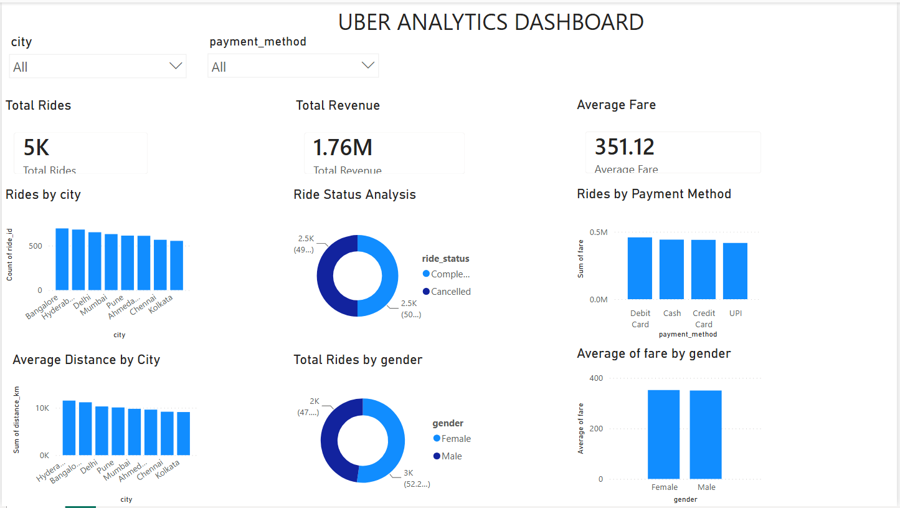

# 🚕 Uber Ride Analytics Project

## 📌 Project Overview

This project analyzes Uber ride data to understand ride patterns,
revenue performance, customer behavior, driver information,
payment methods, ride status, and city-level performance.

The project combines **Excel, SQL, Python, and Power BI** to perform
data analysis and create an interactive business dashboard.

---

## 🎯 Project Objectives

- Analyze overall ride performance
- Calculate total rides and revenue
- Analyze average fare
- Understand payment method usage
- Analyze ride status
- Compare ride performance across cities
- Analyze customer and driver data
- Identify useful business insights
- Build an interactive Power BI dashboard

---

## 🛠️ Tools & Technologies

| Tool | Purpose |
|---|---|
| Excel | Data preparation and basic analysis |
| MySQL | SQL data analysis |
| Python | Data cleaning and exploratory analysis |
| Power BI | Interactive dashboard and visualization |

### Python Libraries

- Pandas
- NumPy
- Matplotlib
- Seaborn

---

## 📊 Dataset

The dataset contains information related to:

- Customers
- Drivers
- Rides
- Payments

The original dataset files are available in the `Dataset` folder.

---

## 📈 Key KPIs

The Power BI dashboard includes:

- **Total Rides**
- **Total Revenue**
- **Average Fare**

---

## 📊 Dashboard Analysis

The Power BI dashboard analyzes:

- Rides by City
- Revenue by Payment Method
- Ride Status Analysis
- Rides by Gender
- Average Distance by City
- Rides by Payment Method

### 🔎 Interactive Filters

- City
- Payment Method

---

## 🖼️ Dashboard Preview



---

## 📂 Project Structure

```text
Uber_Ride_Analytics_Project/
│
├── Dataset/
│   ├── customers.csv
│   ├── drivers.csv
│   ├── payments.csv
│   └── rides.csv
│
├── Excel/
│
├── SQL/
│
├── Python/
│
├── PowerBI/
│
├── Images/
│   └── dashboard.png
│
└── Documentation/

Author
Kowsalya.R
Aspiring Data Analyst | Python | SQL | Power BI | Excel
